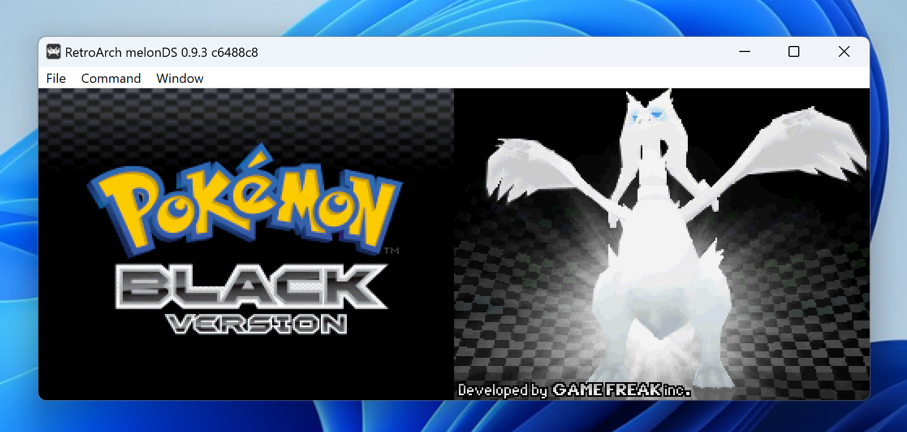

# TwitchKeyboardAPI - For Windows

TwitchKeyboardAPI is an API that will monitor incoming commands from a Twitch chat and send them to a game emulator.


## Table of Contents

- [TwitchKeyboardAPI - For Windows](#twitchkeyboardapi---for-windows)
  - [Table of Contents](#table-of-contents)
  - [Getting Started](#getting-started)
    - [**Optional** Automated Setup Script for Windows](#optional-automated-setup-script-for-windows)
    - [Prerequisites](#prerequisites)
    - [Step 1: Emulator Installation](#step-1-emulator-installation)
    - [Step 2: API Initialization](#step-2-api-initialization)
    - [Step 3: Using the API](#step-3-using-the-api)
  - [Commands](#commands)
    - [General Commands](#general-commands)
    - [Broadcaster And Mod Only Commands](#broadcaster-and-mod-only-commands)
  - [FAQ](#faq)
    - [How can I still use my computer while the API is running since the window focused on RetroArch for ever command?](#how-can-i-still-use-my-computer-while-the-api-is-running-since-the-window-focused-on-retroarch-for-ever-command)
  - [Development](#development)
    - [Support](#support)
    - [License](#license)

## Getting Started

### **Optional** Automated Setup Script for Windows

If you already have a development environment set up, you can skip this step. But for those who don't, you can use the [`setup.ps1` script](./scripts/setup.ps1) to install the necessary dependencies. This script will install the following:

- Pyenv - Python 3.11.9
- Poetry
- Git
- GitHub CLI

_**Note:** You wll run the script about 3 times total if you do not have any of the dependencies installed. This is because the terminal needs to be restarted after installing some of the dependencies._

### Prerequisites

- Python 3.11.9
- Poetry
- Windows 10 / Windows 11

### Step 1: Emulator Installation

_**Note:** For the sake of this example, assume you are downloading a Nintendo DS game but the process is similar for other consoles._

1. Download the RetroArch game emulator from the [official website](https://www.retroarch.com/?page=platforms).
2. Open the RetroArch emulator.
3. Go to `Load Core`.
   <div></div>
4. Select `Download a Core`.
   <div></div>
5. Select the `Nintendo - Nintendo DS (melonDS)` core.
   <div></div>
6. Download the `.nds` ROM of the game you want to play. You can find a list of
games [here](https://www.emulatorgames.net/roms/nintendo-ds/).
   <div></div>
7. Go to `Load Content`.
   <div></div>
8. Select `Start Directory`.
   <div></div>
9. Find and select the folder where the `.nds` ROM is located.
   <div></div>
10. You should now be able to play the game using the emulator.
<div></div>

### Step 2: API Initialization

1. Clone the repository

```bash
git clone git@github.com:open-octave/TwitchKeyboardAPI.git
```

2. Run the API

```bash
./run.bat
```

### Step 3: Using the API

1. Go to the Twitch chat.
2. It's recommended that you use the mod commands `/uniquechatoff` and `/slowoff` in chat to allow viewers to send commands without being blocked by Twitch.
3. Type one of the commands listed in the [Commands](#commands) section.
4. The API will receive the command and send it to the emulator.

| On Start Example                                                                 | Command Example                                                                   |
| -------------------------------------------------------------------------------- | --------------------------------------------------------------------------------- |
| <div></div> | <div></div> |

## Commands

_**Note:** The command mapping is designed based on the default key bindings of the RetroArch emulator._

### General Commands

| Command                                    | Description                                       |
| ------------------------------------------ | ------------------------------------------------- |
| `up`                                       | Simulates a up arrow key press                    |
| `down`                                     | Simulates a down arrow key press                  |
| `left`                                     | Simulates a left arrow key press                  |
| `right`                                    | Simulates a right arrow key press                 |
| `a`                                        | Simulates an X key press                          |
| `b`                                        | Simulates a Z key press                           |
| `x`                                        | Simulates an S key press                          |
| `y`                                        | Simulates an A key press                          |
| `start`                                    | Simulates an Enter key press                      |
| `select`                                   | Simulates a Shift key press                       |
| `!hold <direction>` or `!move <direction>` | Holds the provided directional key until released |
| `!release` or `!stop`                      | Releases the held directional key                 |
| `!toggle-fast-forward` or `!tff`           | Toggles RetroArch's fast forward mode on/off      |

### Broadcaster And Mod Only Commands

| Command         | Description                                   |
| --------------- | --------------------------------------------- |
| `!mod-kill-api` | Kills the API process in case of an emergency |

## FAQ

### How can I still use my computer while the API is running since the window focused on RetroArch for ever command?

You can run the API and RetroArch inside of VMWare or VirtualBox. I honestly recommend this method since it also gives the streamer an extra layer of security since the API does not have access to the files, folders, or applications on the streamer's computer. This should never be possible due to a few security measures in place but it is always better to be safe than sorry.

[Windows Virtual Machines](https://developer.microsoft.com/en-us/windows/downloads/virtual-machines)

## Development

### Support

If you have any questions or need help, please open an issue in the repository or message me on discord:

Discord: [Project Channel](https://discord.com/channels/1202928165224194058/1233983594515398737)

### License

Distributed under the GNU General Public License. See `LICENSE` for more information.
